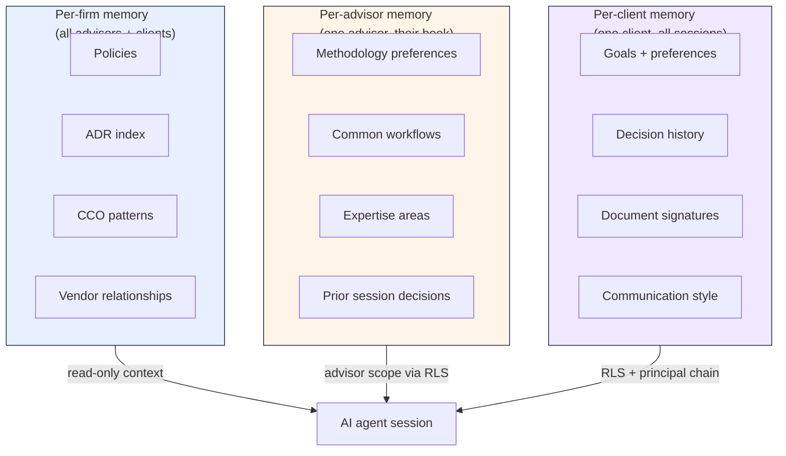
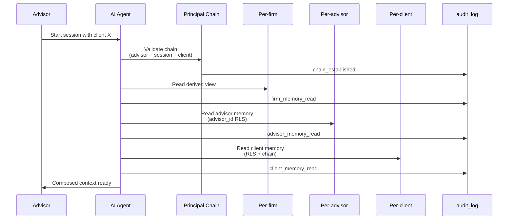

# Three-tier agent memory architecture

> Adopter-facing companion to the canonical ADR (consumer-side; lives in
> the RIA's `shared/architecture/decisions/ADR-three-tier-agent-memory.md`).
> Reference implementation at [`examples/rias-agent-substrate/`](../examples/rias-agent-substrate/).
> Indexed in [`CANONICAL-PATTERNS.md`](./CANONICAL-PATTERNS.md) as Pattern #7.

## Why three tiers

An AI agent in an RIA (Registered Investment Adviser) context has three legitimate memory scopes — per-client, per-advisor, per-firm — each with distinct retention, access control, and audit requirements. Composing them as separate substrate tiers (rather than a single union-typed memory blob) is what makes per-scope enforcement structural rather than disciplinary.

Without a canonical three-tier substrate, every agent-facing surface reinvents the per-client / per-advisor / per-firm scoping at the application layer, with predictable failure modes:

- **Cross-client leakage** — an agent trained on one client's session memory leaking that context into another client's session (the canonical RIA fiduciary failure mode)
- **Per-advisor methodology drift** — an agent that doesn't remember the advisor's prior decisions across sessions, forcing the advisor to re-instruct on common workflows
- **Firm-wide compliance state opacity** — an agent that has no canonical access to the firm's compliance posture, current ADRs, or CCO-approved patterns, making compliance-aware decisions agent-context-dependent rather than substrate-enforced

The three-tier model anchors each scope on the substrate primitive that best matches its retention + RBAC posture.

## The three tiers at a glance



| Tier | Storage shape | RBAC | Retention |
|---|---|---|---|
| **Per-client** | Existing `client_profile` + `audit_log` principal-chain queries (no new table) | Postgres RLS on `client_id` + principal-chain authorization | 7-year post-relationship per 17 CFR §240.17a-4; inherits audit-log WORM mirror |
| **Per-advisor** | NEW `advisor_memory` table (advisor_id + memory_key + JSONB value + pii_tags) | Postgres RLS on `advisor_id` | 7-year post-departure per 17 CFR §240.17a-4 |
| **Per-firm** | Derived from version-controlled markdown (`shared/` git history); no Postgres table | Read-only by construction | Git-history unbounded; commit log IS the audit trail |

## Composition at agent-session time

The three tiers compose in **fixed order** at every agent context assembly: firm (broadest, read-only) → advisor (advisor scope) → client (most-scoped, principal-chain-authorized). Every read writes an `audit_log` row so the agent's own context-assembly is audit-trail-eligible by construction.



Each of the four audit rows references the chain-establishment row's id as `anchor_audit_id` so retention queries can reassemble the composition from its anchor.

## Substrate primitive composition

The three tiers compose against existing pwos-core primitives — no new primitive package is introduced by this architecture; the architecture is what composes the existing ones into a coherent per-tier substrate.

| Tier | Primary primitive | Supporting primitives |
|---|---|---|
| **Per-client** | `@protocolwealthos/audit-log` (principal-chain queries derive decision history) | `@protocolwealthos/pii-guard` (4-layer PII scanner at memory-read boundary); existing `client_profile` table is consumer-side |
| **Per-advisor** | New `advisor_memory` table (consumer-side migration) | `@protocolwealthos/audit-log` (`source_audit_id` back-reference for each memory entry) |
| **Per-firm** | Derived view (consumer-side; build-time materialization) | None — version-controlled markdown is its own substrate |

Cross-cutting:

- **Principal-chain validation** at every cross-tier read; the chain is the authorization trace + the audit-log anchor row references every memory tier accessed
- **PII guard** at the memory-read boundary applies the same exclusion logic for prompt construction as `ADR-PII-tagging.md` codifies for other LLM-bound payloads
- **WORM-mirrored audit trail** via `ADR-gcs-worm-audit-mirror.md` substrate; the agent's context-assembly audit rows inherit the same retention as every other audit row in the system

## Per-tier substrate enforcement

### Per-client — RLS + principal chain

Production consumers wire Postgres RLS policies on `client_profile`:

```sql
CREATE POLICY client_profile_advisor_scope ON client_profile
  USING (
    client_id IN (
      SELECT client_id FROM advisor_client_assignments
      WHERE advisor_id = current_setting('request.advisor_id')::uuid
    )
  );
```

The reference implementation enforces the same contract at the TypeScript layer via `ClientMemoryStore.readForClient(clientId, authorizedClientIds)`. An attempt to read outside the authorized set throws `UnauthorizedMemoryAccess` — the production failure mode and the in-memory failure mode are the same shape.

### Per-advisor — advisor_id RLS

Production consumers add the `advisor_memory` migration with the RLS policy:

```sql
CREATE TABLE advisor_memory (
  id            UUID PRIMARY KEY DEFAULT gen_random_uuid(),
  advisor_id    UUID NOT NULL REFERENCES advisors(id),
  memory_key    TEXT NOT NULL,
  memory_value  JSONB NOT NULL,
  source_audit_id UUID REFERENCES audit_log(id),
  pii_tags      TEXT[] DEFAULT '{}',
  created_at    TIMESTAMPTZ NOT NULL DEFAULT NOW(),
  updated_at    TIMESTAMPTZ NOT NULL DEFAULT NOW(),
  UNIQUE (advisor_id, memory_key)
);

ALTER TABLE advisor_memory ENABLE ROW LEVEL SECURITY;

CREATE POLICY advisor_memory_advisor_scope ON advisor_memory
  USING (advisor_id = current_setting('request.advisor_id')::uuid);
```

The reference implementation's `AdvisorMemoryStore` interface mirrors the contract; in-memory enforcement throws `UnauthorizedMemoryAccess` on advisor-id mismatch.

**Memory key canonical namespaces:**

- `methodology.<topic>` — analytical preferences (e.g., `methodology.equity_screening`)
- `workflow.<topic>` — common operational workflows (e.g., `workflow.quarterly_review`)
- `expertise.<topic>` — advisor expertise areas (e.g., `expertise.tax_loss_harvesting`)
- `preference.<topic>` — advisor configuration (e.g., `preference.report_style`)

Enforce the namespace convention via Zod schema at write time, not via column constraint — per-advisor methodology is genuinely heterogeneous and the value-shape stays open.

### Per-firm — read-only derivation

Per-firm memory has **no write path in code**. Updates are version-control commits in the firm's `shared/` repo. The derived view materializes at build time:

```
pwos.app/agents/firm-substrate
  ├─ /policies        (rendered from shared/docs/compliance/*.md)
  ├─ /adrs            (rendered from shared/architecture/decisions/*.md index)
  ├─ /cco-approvals   (rendered from shared/compliance/cco-approvals/*.md)
  ├─ /vendors         (rendered from shared/docs/compliance/subprocessors-inventory.md)
  └─ /changelog       (rendered from shared/compliance/COMPLIANCE-CHANGELOG.md)
```

The reference implementation's `FirmMemorySource.read()` returns a `FirmMemory` snapshot with `generatedAt` set; production implementations materialize this snapshot at deploy time and bound the agent's context to canonical state at last successful build.

## Adopter playbook

If you're building an AI agent for an RIA today and want to adopt the three-tier architecture, the canonical steps are:

1. **Add `advisor_memory` migration** with the schema above + advisor_id-RLS policy
2. **Wire RLS on `client_profile`** if not already present (most RIAs already have this)
3. **Implement the per-tier store interfaces** from the reference example against your Postgres connection (substitute the in-memory implementations)
4. **Implement `FirmMemorySource.read()`** as a build-time derivation step (one approach: a small Node script in your deploy pipeline reads `shared/` markdown + emits a JSON snapshot the build picks up)
5. **Compose with `RIAAgentSubstrate`** and inject into your agent runtime — every agent session opens via `buildAgentContext({ advisorId, sessionId, clientId })`
6. **Confirm audit-row shape** matches your retention substrate (`agent.context.chain_established` / `agent.context.firm_memory_read` / `agent.context.advisor_memory_read` / `agent.context.client_memory_read`)

The reference implementation at `examples/rias-agent-substrate/` ships with hermetic tests (no network calls; synthetic fixtures) so you can run the composition flow locally before wiring against your own infrastructure.

## What this architecture deliberately does NOT do

- **No vendor-side memory for per-client or per-advisor tiers.** Inference data crossing the substrate boundary into vendor storage (Anthropic memory tools, e.g.) violates the "PII never crosses the substrate boundary" posture. Vendor-side caching is acceptable for per-firm memory only (per-firm content is already firm-wide public substrate by construction; prompt-cache at the system-prompt level is fine).
- **No agent-side memory editing in v0.1.** Read-only memory views ship first (architecture-explainer + aggregate metrics + per-advisor own-memory view). Write paths for training feedback + advisor-side memory editing ship in v1.0 against CCO Marketing Rule review of the client-side transparency surface.
- **No cross-advisor memory sharing.** Per-advisor memory is advisor_id-scoped; an advisor cannot directly access another advisor's methodology notes. Cross-advisor patterns flow through the per-firm tier as CCO-approved patterns published as ADRs and rendered into the per-firm derived view — never through cross-advisor memory access.

## Reference material

- ADR (canonical; consumer-side): `shared/architecture/decisions/ADR-three-tier-agent-memory.md`
- Reference implementation: [`examples/rias-agent-substrate/`](../examples/rias-agent-substrate/)
- Sibling ADRs (consumer-side):
  - `shared/architecture/decisions/ADR-PII-tagging.md` — structural-over-disciplinary precedent
  - `shared/architecture/decisions/ADR-gcs-worm-audit-mirror.md` — audit substrate for memory-read records
- Pwos-core primitives composed:
  - `@protocolwealthos/audit-log` — principal-chain queries + retention substrate
  - `@protocolwealthos/pii-guard` — memory-read PII boundary
  - `@protocolwealthos/ai-guardrails` — content-free audit-row builder for LLM-call records

## License

Apache 2.0. The architecture is open for adopters to fork, modify, and contribute back to this canonical via PR against the reference example or the CANONICAL-PATTERNS index.
